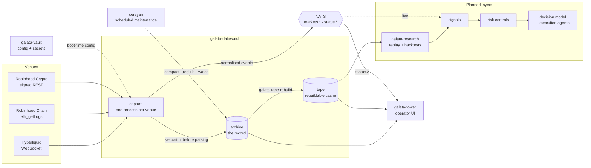

<picture>
  <source media="(prefers-color-scheme: dark)" srcset="assets/logo-on-dark.svg">
  
</picture>

# galata-datawatch

[](https://github.com/sercanatalik/galata-datawatch/actions/workflows/check.yml)
[](LICENSE-MIT)
[](rust-toolchain.toml)
[](#roadmap)

**Multi-venue market data capture and Parquet archival, in Rust.**

galata-datawatch captures market data from several venues. Every payload is
stored verbatim before anything parses it, gaps are recorded as explicit
events, and a queryable Parquet tape can be rebuilt from that archive at any
time. It is the data layer of **Galata**, a low-latency algorithmic trading
framework.

> **Status: pre-0.1.0.** Capture, the archive, the tape, the broker, vault
> integration and scheduled maintenance are all built, and the reference
> deployment runs them as launchd services. Nothing is on crates.io yet. Publishing 0.1.0 is the
> next milestone. See the [Roadmap](#roadmap).

---

## Contents

- [Galata at a glance](#galata-at-a-glance)
- [Design principles](#design-principles)
- [Architecture](#architecture)
- [The crates](#the-crates)
- [Venues](#venues)
- [Quick start](#quick-start)
- [Storage layout](#storage-layout)
- [Querying the tape](#querying-the-tape)
- [Operations](#operations)
  - [Configuration and secrets](#configuration-and-secrets)
  - [Scheduled maintenance](#scheduled-maintenance)
  - [Running as services](#running-as-services)
- [Development](#development)
- [Publishing](#publishing)
- [Roadmap](#roadmap)
- [Related repositories](#related-repositories)
- [Licence](#licence)

---

## Galata at a glance

Galata is a Rust framework for low-latency algorithmic trading. It covers the
whole path from market data to orders:

1. **Multi-venue market data capture.** This repository.
2. **Research and replay.** Strategies are tested only against the data they
   could have seen at the time.
3. **Signal generation.** Features and signals are computed from the tape and
   can be reproduced from the archive.
4. **Deterministic portfolio risk controls.** Plain, auditable code that sits
   between every decision and every order. No model can override it.
5. **Agentic strategy execution.** A fine-tuned decision model turns market
   signals into calibrated probabilities. Execution agents act on those
   probabilities, inside the limits the risk layer sets.

Every layer after the first reads from the record this repository keeps, so
the record has to be complete and replayable, and it has to state its gaps.
Backtests and live runs therefore work from the same bytes.

### Infrastructure



| Component | Role | Repository |
|---|---|---|
| **galata-datawatch** | capture, the archive, the tape, the broker vocabulary | this one |
| **galata-vault** | end-to-end-encrypted configuration and secrets; the single source of both | [sercanatalik/galata-vault](https://github.com/sercanatalik/galata-vault) |
| **galata-tower** | operator UI: axum read API and a React screen in one binary | [sercanatalik/galata-tower](https://github.com/sercanatalik/galata-tower) |
| **cereyan** | the scheduler that runs compaction, tape rebuilds and health checks | [sercanatalik/cereyan](https://github.com/sercanatalik/cereyan) |
| **NATS** | the live bus that downstream strategy processes subscribe to | [nats.io](https://nats.io) |
| **galata-research** | point-in-time replay, one fill model, a run manifest | planned; not yet a repository |

---

## Design principles

| Principle | What it means in practice |
|---|---|
| **Archive first** | Every payload lands verbatim before a parser sees it. A parse bug costs a re-run, never the data. |
| **Gaps are events** | Every absence is written down with its cause and bounds. Nothing is inferred from missing rows. |
| **The frontier is a listing** | "How far am I durable?" is answered from directory entries, with no Parquet decode. |
| **Venues are features** | A venue that is not compiled in cannot be reached, and a guard checks that. |
| **The tape is a cache** | Delete it and `galata-tape-rebuild` writes it again, byte for byte, from the archive. |
| **No float money** | Prices and sizes are decimals end to end. A guard fails any `f64` on a money path. |
| **The loop owns the clock** | Adapters are pure and clockless, so every normalisation can be replayed in a test. |

---

## Architecture

Each venue runs as its own capture process, and every payload follows one
path through it:

```text
  transport ─bytes─▶ Archive ──▶ Adapter::normalise ──▶ Envelope ──▶ Sink (NATS)
  (stream │ poll    (fsync,       (pure: no clock,       (galata-wire)
   │ block range)    rename)       no I/O)
                        │
                        └──────────▶ galata-tape-rebuild ──▶ tape (Parquet, by dataset)
```

- **The transport** sits above the venue seam and owns any credentials: a
  long-lived WebSocket stream, a signed REST poll, or paging a chain by block
  range.
- **`Adapter`** is the venue seam, and it is pure. It turns bytes into
  events, classifies failures, and declares the venue's subscriptions,
  symbols and limits. It never sees a socket or a clock, and it defines no
  method that places, cancels or amends an order.
- **Archive, normalise, emit** is implemented once, in `ingest`, so the order
  holds by construction rather than by convention.
- **Positions** are generalised in `galata-segments` as
  `Cursor::{Time, Block, Seq}`, which makes a blockchain venue a first-class
  source rather than a special case.

Normalised events are published on NATS as `markets.<venue>.<ticker>.<kind>`,
and each capture reports its own health on `status.<venue>`. The two roots are
granted separately, so a dashboard can read status without the market-data
firehose.

---

## The crates

| Crate | Holds | Links |
|---|---|---|
| [`galata-wire`](crates/galata-wire) | the vocabulary: `Envelope`, `Event`, `Kind`, `Series`, `Ticker`, `Num` | `serde` only |
| [`galata-broker`](crates/galata-broker) | `Publisher`/`Subscriber`, subjects, identities and grants, the NATS implementation | `galata-wire` |
| [`galata-segments`](crates/galata-segments) | durable Parquet segments: write, sync, rename, compact | `arrow`, `parquet` |
| [`galata-datawatch`](crates/galata-datawatch) | the record, the venue seam, the capture loop, the tape, the operator binaries | all three |

A downstream process that only needs to *hear* market data takes the first
two, and links no columnar format:

```toml
galata-wire   = "0.1"
galata-broker = "0.1"
```

`crates/galata-datawatch-vault` is an unpublished fifth member. It keeps the
vault integration in the workspace so that a guard can prove the four
published crates link none of it.

### Binaries

| Binary | Purpose |
|---|---|
| `galata-datawatch` | capture one venue, with configuration from a file |
| `galata-datawatch-vault` | the same, with configuration and secrets fetched from galata-vault at boot |
| `galata-tape-rebuild` | project the archive into the tape; `--replace` rebuilds a venue's range |
| `galata-compact` | merge the small segments of closed days (never today) |
| `galata-watch` | judge the record's freshness and completeness, per venue |
| `galata-retain` | report, and optionally delete, what a retention horizon would expire |

---

## Venues

```sh
cargo add galata-datawatch --features rh-chain
```

| Feature | Venue | Source | Credential | Instruments (v0.1) |
|---|---|---|---|---|
| `hyperliquid` | Hyperliquid perps, including the HIP-3 `xyz` dex | WebSocket stream | none | BTC, ETH, HYPE, `xyz:WTIOIL`, `xyz:XYZ100`, `xyz:GOLD` |
| `rh-chain` | Robinhood Chain (Arbitrum Orbit L2, chain 4663) | block cursor over `eth_getLogs`, bounded at finalized | provider RPC key | tokenized equities |
| `rh-crypto` | Robinhood Crypto Trading API | signed REST poll (Ed25519) | API key + private key | top of book |

Hyperliquid captures `bbo`, trades, candles and `activeAssetCtx`. Its `bbo`
and rh-crypto's `best_bid_ask` share one `quotes` dataset, so a cross-venue
quote comparison is a single-table query.

**A venue can live in your own crate.** `Adapter`'s documentation carries a
worked example that compiles.
[`tests/out_of_tree_venue.rs`](crates/galata-datawatch/tests/out_of_tree_venue.rs)
checks that claim: cargo builds the file as a separate crate, so it sees only
what an outside user sees. If a venue needs something private, the compiler
names it. docs.rs builds with `all-features = true`, so every venue is
documented and each gated item shows the feature it needs.

---

## Quick start

Requirements: Rust 1.98 (pinned by `rust-toolchain.toml`). NATS is optional
for local capture, and [uv](https://docs.astral.sh/uv/) is needed for the
scheduled flows.

```sh
git clone https://github.com/sercanatalik/galata-datawatch
cd galata-datawatch

cargo test                                   # no network access
cargo run --release --bin galata-datawatch   # capture Hyperliquid into var/archive
cargo run --release --bin galata-tape-rebuild -- --help
```

The capture binary reads [`config/datawatch.toml`](config/datawatch.toml),
the committed and annotated configuration, unless `GALATA_CONFIG` names
another file. A configuration that is absent, unparseable or out of bounds is
rejected at load, and the process exits non-zero before it does anything.

---

## Storage layout

```text
  var/archive/                    THE RECORD: one row per payload, verbatim,
   venue=hyperliquid/               before any parse was attempted
     kind=quotes/
       date=2026-09-20/
         t-1758326400000000_1758326460000000_4711_3.parquet
         failures/                  same sequence, no payload column

  var/tape/                       THE CACHE: one row per event, typed, by
   kind=quotes/                     venue time, rebuildable from the record
     date=2026-09-20/
       s-1790058447399177_1790058637809031.parquet
```

The archive is partitioned by venue, because its unit is the capture: a
venue's bytes are kept, replayed or dropped as one subtree. The tape's unit is
the dataset, so one dataset across every venue is a single prefix. In the
tape, `venue` is a column and deliberately not a directory level. Written
both ways, DuckDB's `hive_partitioning` flag decides which value a reader
sees, with no warning.

Segment filenames carry the range they cover and the fact that they are
durable. A segment is only named after its bytes have been synced, so readers
never see a half-written file. See
[`galata-segments`](crates/galata-segments/README.md).

---

## Querying the tape

The tape is plain, Hive-partitioned Parquet. DuckDB, polars and pyarrow read
it with no flags:

```sql
SELECT * FROM read_parquet('var/tape/kind=quotes/**/*.parquet');
```

| Dataset | Contents |
|---|---|
| `quotes` | top of book: bid/ask price and size |
| `trades` | executions, with the venue's `trade_id` |
| `candles` | OHLCV bars, live and walked back through venue history |
| `funding` | funding rates |
| `marks` | mark, index and oracle prices, and open interest |
| `gaps` | every known absence, with cause and bounds |

Two things to know before filtering:

- **`at_micros` is null when the venue did not timestamp the event.** That is
  common. Over a 24-minute run, 100% of `marks` and 89% of `funding` had no
  venue time, against 0% of `quotes` and `trades`. Filling in the receipt time
  would turn missing information into a latency of zero, so the column stays
  null, and `WHERE at_micros BETWEEN …` silently drops all of `marks`. Filter
  on `recv_micros`, or use the bounded reader.
- **An execution can arrive twice.** A venue that replays recent history on
  subscribe does so again on every reconnection: 1.55% of a 24-minute run,
  once per session rotation. Both receipts are recorded because both
  happened. Group on `trade_id` to count each execution once.

---

## Operations

### Configuration and secrets

In production, [galata-vault](https://github.com/sercanatalik/galata-vault) is
the single source of configuration and secrets. The unpublished
`galata-datawatch-vault` binary fetches the configuration document once at
boot and passes it to the same validator the file binary uses. If the
configuration names a broker password, it fetches that secret once too. The
capture loop never holds the vault or the credential.

```sh
# Install the published galata-vault 0.4 tools.
curl --proto '=https' --tlsv1.2 -LsSf \
  https://github.com/sercanatalik/galata-vault/releases/latest/download/gv-installer.sh | sh
curl --proto '=https' --tlsv1.2 -LsSf \
  https://github.com/sercanatalik/galata-vault/releases/latest/download/gv-server-installer.sh | sh

# Provision a project and environment. Keep the recovery kit gv init writes.
gv-server local
gv init galata-datawatch --server http://127.0.0.1:8750
gv env add galata-datawatch/prod
gv config set datawatch --format toml --env galata-datawatch/prod < config/datawatch.toml
```

The binary opens the vault through the SDK's environment contract: set
`GV_SERVER`, then exactly one of `GV_TOKEN` or `GV_TOKEN_FILE`. A token file
must be mode `0600` or `0400`. Mint the smallest token the document needs:

```sh
# No [broker] block: configuration documents only.
gv token mint --scope config --env galata-datawatch/prod

# With [broker]: the document, plus only the named broker secret.
printf %s "$BROKER_PASSWORD" | \
  gv set GALATA_DATAWATCH_PASSWORD --env galata-datawatch/prod
gv token mint --scope read --only GALATA_DATAWATCH_PASSWORD \
  --env galata-datawatch/prod
```

`password_var` names an environment variable for the file binary, and a vault
secret for the vault binary. Use a child vault when credentials must be
cryptographically isolated between instances or venues. An allow-list is
server policy, not a second encryption boundary.

The broker secret is kept out of the capture process's environment. The
generated NATS authorization file still reads it from the NATS server's
environment.

### Scheduled maintenance

Capture writes the archive, and four one-shot tools maintain it. **The tape
exists only when `galata-tape-rebuild` runs**, so it needs a schedule. The
schedule is `py/`: a [cereyan](https://github.com/sercanatalik/cereyan) lane
whose flows only call the release binaries as subprocesses.

| Flow | Runs | When (UTC) |
|---|---|---|
| `compact-the-archive` | `galata-compact` | daily 00:10 |
| `project-the-closed-days` | `galata-tape-rebuild --replace`, the last 3 closed days, per declared venue | daily 00:40 |
| `report-what-retention-would-expire` | `galata-retain`, report only | Sundays 01:30 |
| `judge-the-record` | `galata-watch` | hourly at :05 |
| `rebuild-one-day` | `galata-tape-rebuild --replace <venue> <date>` | on demand, for backfills |

```sh
cargo build --release              # add --features rh-chain if it is declared
uv sync --project py
cd py && CEREYAN_HOME=~/.cereyan-galata uv run cereyan serve . --no-open
```

- **The lane has its own cereyan home.** `~/.cereyan` is shared with every
  other cereyan project on the machine, and a server started there would
  schedule their flows too.
- **One configuration per deployment.** Capture and the lane both use
  `var/datawatch.local.toml` if it exists (the committed file plus this
  machine's `[broker]` and `[watch]` blocks), and `config/datawatch.toml`
  otherwise. The two are never merged.
- **Build the features your venues need.** A binary that cannot speak a
  declared venue rejects the whole configuration, and every scheduled job
  fails with the venue's name until the build matches.

Several things are ruled out by construction, and
`scripts/check-python-flows.sh` enforces them over the lane's import graph:

- **No credentials are passed.** A job's environment is built from scratch
  (`GALATA_CONFIG`, `PATH`, `RUST_LOG`, `NO_COLOR`). The rebuild uses
  `AdapterConfig::for_replay`, which withholds keyed providers, so a keyed
  chain venue can be projected every night without a key in reach.
- **Nothing deletes.** `galata-retain --delete` is not a flow, because
  cereyan's MCP `run_flow` can start any registered flow.
- **The scheduler holds no state that matters.** The projection takes a fixed
  window, not a cursor, so deleting cereyan's store changes nothing.

### Running as services

On macOS the deployment runs as launchd agents (`com.galata.*`). They are
rendered from one tracked template and restarted whenever they exit.

| Service | Listens on | Reads |
|---|---|---|
| `vault` (`gv-server local`) | `127.0.0.1:8750` | its data directory, `~/.local/share/galata-vault` |
| `nats` | `127.0.0.1:4222` | all three broker passwords |
| `capture:<venue>` | outbound only | its venue's configuration and credentials |
| `tower` | `127.0.0.1:8777` | the `reader` broker password |
| `flows` (cereyan) | `127.0.0.1:4200` | nothing |

```sh
cargo build --release
(cd ../galata-tower && cargo build --release)
scripts/install-services.sh                        # vault, nats, capture:hyperliquid, tower, flows
scripts/install-services.sh capture:rh-chain       # add a venue
scripts/install-services.sh --uninstall tower      # remove one
scripts/install-services.sh --status               # every com.galata.* agent, flagging strays
```

First-time setup on a new machine, after `scripts/install-services.sh vault`:

```sh
scripts/provision-vault.sh        # project galata-datawatch, env .../prod, secrets imported
scripts/mint-service-tokens.sh    # var/tokens/<service>.gvt, mode 0600, valid 365 days
```

- **Each service reads only its own secrets**, through a token minted for it
  alone, using `galata-vault-exec --only NAME -- <command>`. `gv run` is not
  used because it reads through the owner key, which would give any service
  every secret. No secret goes into a plist, since launchd leaves plists
  readable by every user.
- **The recovery kit** is written to `var/galata-datawatch-recovery.gvkit`.
  It is the only way to recover the project, so move it to offline storage
  and delete that copy.
- **Tokens expire** after 365 days, the server's maximum. Re-run
  `mint-service-tokens.sh` and reinstall the services before then.
- **Stopping is clean.** Capture treats SIGTERM as a shutdown: it flushes,
  and the next start records the outage as `downtime`, not a crash.
  Installing a service twice replaces it, and a hand-started copy is stopped
  first, because two captures of one venue would be two writers to one
  archive.

Logs are written to `var/logs/<service>.log`.

---

## Development

```sh
cargo test                 # the full suite; no network access
scripts/check-all.sh       # format, lints, guards, guard harness, tests, the Python lane
scripts/test-guards.sh     # proves each guard can fail
```

**CI runs `scripts/check-all.sh` and nothing else**, so the badge and the
local command always agree. Everything after the dependency fetch runs with
`--offline`, so an accidental network dependency fails instead of passing
quietly.

The gate includes some twenty structural guards under [`scripts/`](scripts).
Each one is planted with a violation by `test-guards.sh` to show it can go
red. Among them:

| Guard | Holds |
|---|---|
| `check-no-float-money.sh` | no floating-point type on a money path |
| `check-clock-discipline.sh` | nothing below the capture loop reads a clock |
| `check-ingest-callers.sh` | nothing reaches past the one archive → normalise → emit path |
| `check-no-transport.sh` | with `capture` off, `galata-datawatch` links no transport |
| `check-venue-boundary.sh` | exactly one module names a venue; everything above the seam holds a `dyn Adapter` |
| `check-vault-reach.sh` | no published crate links the vault |
| `check-secret-reach.sh` | a secret is read in one place |
| `check-grant-coverage.sh` | every NATS subject root is granted to someone |
| `check-feature-matrix.sh` | every advertised feature combination builds |
| `check-package.sh` / `check-tarball-builds.sh` | every crate builds from its own published tarball |

Design documents live in [`design/`](design), with every measured figure and
the tool that produced it in [`design/measured.md`](design/measured.md).
Changes move through `planning/` → `design/` → `openspec/`.

---

## Publishing

Not published yet. **The order is fixed by the dependency graph**, and a
mistake fails partway through a sequence that cannot be undone, because a
crates.io version is permanent:

```text
  galata-wire        no internal dependencies   ─┐
  galata-segments    no internal dependencies   ─┴─ either order
  galata-broker      needs wire
  galata-datawatch   needs wire, segments, broker
```

Every tarball is verified in the gate before any publish:

```sh
cargo package --workspace     # every crate, built from its own tarball
```

This builds a temporary registry under `target/package` and compiles each
unpacked tarball against the *packaged* versions of its siblings, not the
workspace's path dependencies. Inside a workspace, cargo prefers the path
dependency, so without this a crate can build here while relying on a sibling
change its own manifest does not require.

`scripts/check-package.sh` checks what each tarball *contains*.
`scripts/check-tarball-builds.sh` checks that it *compiles*, with default
features and with each feature set this README advertises. Allow a moment
between publishes so the registry index carries each crate before the next
one resolves it. The full procedure is in [RELEASING.md](RELEASING.md).

---

## Roadmap

The ordering rule is: *build first the things whose wrong answer cannot be
recovered.* A byte that was never captured is gone for good, so the record
came before everything else. The full tiered plan, with the reasoning for
each tier, is [`design/roadmap.md`](design/roadmap.md).

### This repository

| Tier | Milestone | Status |
|---|---|---|
| 0 | **The spine**: `galata-wire` and `galata-segments` | done |
| 1 | **The record**: one venue, archive-first capture, gaps as events | done |
| 2 | **HIP-3 dex support** and the venue's universe check; the planned trading calendar was dropped after the record showed all six instruments trade around the clock | done |
| 3 | **The tape**, the bounded reader, compaction, rebuild and retention tools | done |
| 4 | **The broker**: NATS publisher/subscriber, identities and grants | done |
| 5 | **The vault**: configuration and secrets from galata-vault | done |
| 6 | **galata-tower**: the operator UI over the record | done |
| 7 | **`rh-chain`**: Robinhood Chain via finalized `eth_getLogs`, with reorgs recorded as rows | done |
| 8 | **`rh-crypto`**: the signed REST poll | built; first live poll pending credentials |
| 9 | **Scheduling**: the cereyan lane, `galata-watch`, launchd services | done |
| 10 | **Publish 0.1.0** of the four crates to crates.io | **next** |

Also in progress or planned here:

- **`replace-by-source`** (in progress). `galata-tape-rebuild --replace` must
  never delete tape rows it did not rebuild, even when history walked at boot
  lands in a day that another receipt day also fed.
- **`bound-the-replay`** (planned). A view of the tape *as it stood at time
  T*, so a replay host cannot see data that arrived after its simulated
  clock. It lands together with its first caller, `galata-research`. See
  [`planning/bound-the-replay.md`](planning/bound-the-replay.md).
- **Retention policy** (the operator's decision). `galata-retain` works but
  ships no default horizon.

### The Galata framework

Each later layer reads from the record kept here and never writes to it.

| Phase | Layer | Scope | Status |
|---|---|---|---|
| 1 | **Data foundation** | multi-venue capture, the archive and tape, the broker, the vault, the operator UI | built; publishing |
| 2 | **Research and replay** | `galata-research`: point-in-time replay, a `Strategy` seam shared with live, a virtual clock, one pessimistic fill model, a hashed run manifest, coverage and gaps reported as figures | planned |
| 3 | **Signal generation** | features and signals computed from the tape, published over the same broker, versioned and reproducible from the archive | planned |
| 4 | **Deterministic risk controls** | exposure, limit and loss checks in plain, deterministic code, between every decision and every order; no model can override them | planned |
| 5 | **Agentic strategy execution** | a fine-tuned decision model that turns signals into calibrated probabilities; execution agents size and route orders from them, within the risk limits | planned |
| 6 | **Low-latency order entry** | venue order entry on the same adapter seam as capture, a paper venue before any live one, and latency budgets measured and enforced by the gate | planned |

Two rules carry across every phase:

- **Research reports; it never deploys.** A research result reaches a live
  configuration only through a person. Nothing in research gates, sizes or
  retires anything live.
- **Research comes before the trading half.** Three earlier rewrites of this
  system built trading first and deferred research, and two of them never got
  back to it. Here the harness that says whether a strategy is worth trading
  comes first.

These layers are design intent, not shipped code. Each one moves through
`planning/` → `design/` → `openspec/` before it is built. See
[`planning/README.md`](planning/README.md).

---

## Related repositories

- [**galata-tower**](https://github.com/sercanatalik/galata-tower): the
  operator UI for this record.
- [**galata-vault**](https://github.com/sercanatalik/galata-vault):
  end-to-end-encrypted configuration and secrets.
- [**cereyan**](https://github.com/sercanatalik/cereyan): the scheduler that
  runs the maintenance lane.

## Licence

MIT. See [LICENSE-MIT](LICENSE-MIT).
